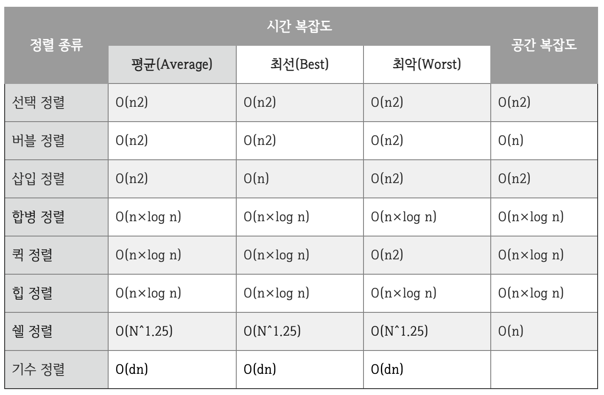
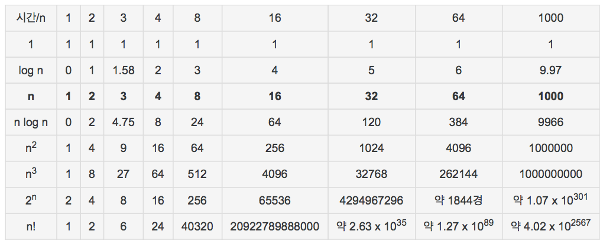

## 2.1 시간 복잡도란?
시간 복잡도는 코드의 실행 시간이 어떤 요인으로 결정되는지 나타내는 시간과 입력 데이터의 함수 관계이다. 코딩 테스트에서는 자신이 짠 코드의 시간 복잡도를 계산하여 문제에서 요구하는 입력을 제한 시간 내에 해결할 수 있는지 파악해야 한다.
### 2.1.1 빅오 표기법
빅오 표기법은 알고리즘이 겪을 수 있는 최악의 경우에 걸리는 시간과 입력 간의 상관관계를 표기한다.
### 2.1.2 시간 복잡도 그래프
_표 2-1 알고리즘과 시간 복잡도_
  
_표 2-2 시간 복잡도별 N 크기에 따른 계산 결과_
  
_그림 2-1 시간 복잡도에 따른 입력과 실행 시간의 상관관계 그래프_
  
그림 2-1에서 알 수 있듯이, 입력 크기가 커지면 커질수록 시간 복잡도에 따른 실행 시간 차이는 굉장히 커진다. 규모가 큰 서비스일수록 효율적인 코드가 중요한 이유이다.
### 2.1.3 입력 데이터 개수별 사용 가능한 시간 복잡도 알고리즘
## 2.2 시간 복잡도 계산하기
### 2.2.1 어림짐작해보기
### 2.2.2 시간 복잡도를 줄이는 방법
### 2.2.3 여러 알고리즘을 사용할 때 시간 복잡도 생각해보기
=> 시간 복잡도는 코드를 작성하기 전 자신의 풀이가 충분히 효율적인지 판단할 수 있는 굉장히 중요한 요소이다.

